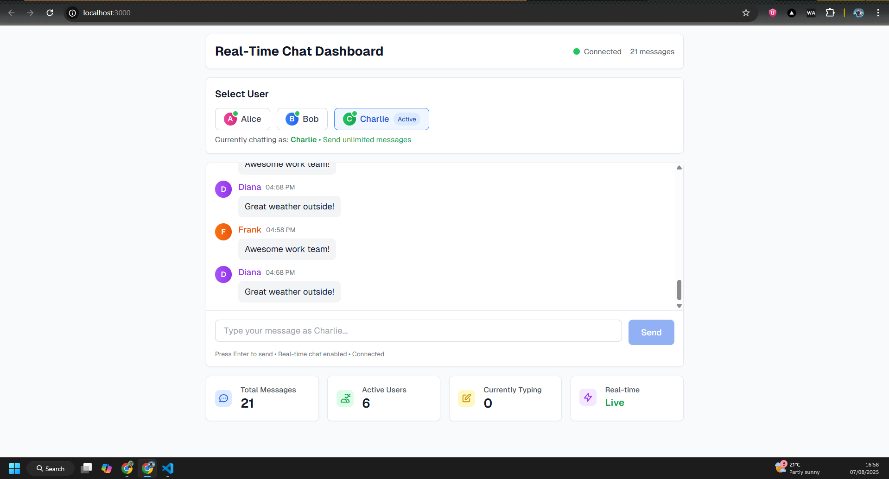

# Real-Time Chat Dashboard

A full-stack real-time chat application built with Next.js frontend and Node.js/Express backend using Socket.io for WebSocket communication.

## Features

- **Real-time messaging** with Socket.io WebSocket connection
- **Typing indicators** showing when users are typing
- **Live message updates** without page refresh
- **Responsive design** with Tailwind CSS
- **Connection status** indicator
- **Message statistics** dashboard
- **Simulated chat activity** for demonstration

## Tech Stack

### Frontend
- **Next.js 14** - React framework with App Router
- **React 19** - UI library
- **TypeScript** - Type safety
- **Socket.io Client** - Real-time communication
- **Tailwind CSS** - Utility-first CSS framework

### Backend
- **Node.js** - Runtime environment
- **Express.js** - Web framework
- **Socket.io** - WebSocket library for real-time communication
- **CORS** - Cross-origin resource sharing

## Setup Instructions

### Prerequisites
- Node.js (v16 or higher)
- npm or yarn package manager

### Installation

1. **Install dependencies**
   \`\`\`bash
   npm install
   \`\`\`

### Running the Application

#### Start both frontend and backend together
\`\`\`bash
npm run dev
\`\`\`

This will start:
- Backend server on `http://localhost:3001`
- Frontend development server on `http://localhost:3000`

#### Run separately (optional)

**In a new terminal, start the backend and frontend:**
\`\`\`bash
npm run dev
\`\`\`

## API Endpoints

### REST API
- **GET /api/messages** - Returns the most recent messages

### WebSocket Events
- **connection** - User connects to chat
- **send_message** - Send a new message
- **new_message** - Receive new message broadcast
- **typing** - User is typing
- **user_typing** - Receive typing indicator
- **user_stopped_typing** - Typing indicator removed
- **user_joined** - User joins the chat
- **user_left** - User leaves the chat
- **disconnect** - User disconnects

## Testing Real-Time Behavior

1. **Open multiple browser tabs** to `http://localhost:3000`
2. **Send messages** from different tabs to see real-time updates
3. **Start typing** in one tab to see typing indicators in others
4. **Watch the connection status** indicator (green = connected, red = disconnected)
5. **Observe simulated activity** - the app automatically generates messages and typing indicators

## Key Features Implemented

### Frontend Features
- ✅ Scrollable message list with real-time updates
- ✅ Typing indicators with animated dots
- ✅ WebSocket connection with Socket.io
- ✅ Responsive design with Tailwind CSS
- ✅ Message input with Enter key support
- ✅ Connection status indicator
- ✅ User avatars and message timestamps
- ✅ Statistics dashboard
- ✅ Chat-like message bubbles
- ✅ Online user status indicators

### Backend Features
- ✅ Express server with CORS support
- ✅ Socket.io WebSocket implementation
- ✅ GET /api/messages endpoint
- ✅ Real-time message broadcasting
- ✅ Typing event handling
- ✅ User session management
- ✅ Connection management
- ✅ Message cleanup for performance

### Real-Time Behaviors
- ✅ Live message updates across all connected clients
- ✅ Typing indicators appear/disappear automatically
- ✅ Connection status updates
- ✅ User join/leave notifications
- ✅ Automatic message simulation for demo purposes
- ✅ Continuous messaging support

---

## Troubleshooting

### Common Issues

1. **Connection failed**: Ensure the backend server is running on port 3001
2. **CORS errors**: The server includes CORS middleware for development
3. **Port conflicts**: Change the port in `server.js` if 3001 is occupied
4. **Bundling issues**: The project uses Next.js which handles bundling automatically

### Development Tips
- Use browser developer tools to monitor WebSocket connections
- Check the console for connection status and error messages
- The app includes extensive logging for debugging
- Works in offline mode if server is not available

---

## 📞 Contact

### Get in Touch

**Derrick Karanja** - Software Developer

- 📧 **Email**: [derricks01.kk@outlook.com](mailto:derricks01.kk@outlook.com)
- 💼 **LinkedIn**: [linkedin.com/in/derks01](https://linkedin.com/in/derks01)
- 🐱 **GitHub**: [github.com/derksKCodes](https://github.com/derksKCodes)
- 🌐 **My Portfolio**: [My Portfolio](https://derrickportfolioweb.vercel.app/)

---